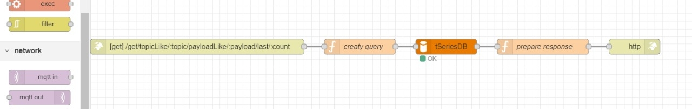

# Build Your Own IoT Platform 
## Creating a REST Interface
### Actividad Calificada 2
- Tacca Gutierrez, Jesus
- Quispe Menor, Hermogenes
## Herramientas
- Docker
- Mosquitto
- MariaDB - phpMyAdmin
- Node-RED

## Build
```bash
docker-compose up
```
- Importar el archivo JSON con el flow Node-RED

## Data Access APIs
- Condition-based data request API sequence <br/>
&nbsp;
- Output 1 <br/>
&nbsp;
- Output 2 <br/>
&nbsp;
- Output 3 <br/>
&nbsp;

## Adding Time-Based Filters
- Time-based data request API sequence <br/>
&nbsp;
- Output 1 - Before <br/>
&nbsp;
- Output 2 - After <br/>
&nbsp;
- Output 3 - During <br/>
&nbsp;

## Data Deletion APIs
- Delete API sequence <br/>
&nbsp;
- Output 1 <br/>
&nbsp;


